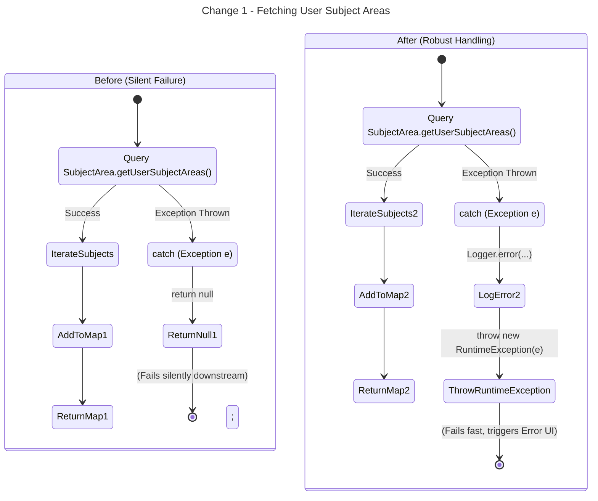
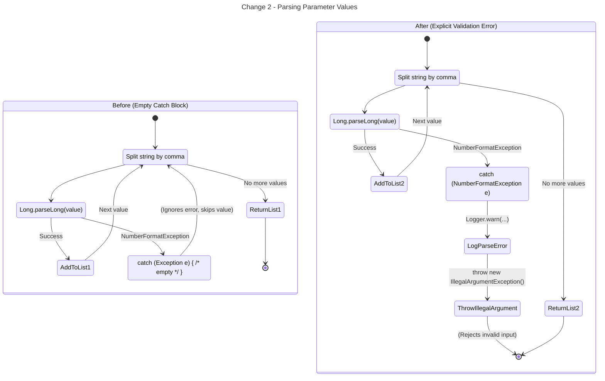

# Activity Diagrams: Exception Handling Refactoring

The following Activity Diagrams illustrate the control flow changes made to remediate the three logic-related bugs (silent failure paths and empty catch blocks) in the Point-In-Time Data reporting system. Each diagram contrasts the **Before** (bugged) state with the **After** (fixed) state.

## 1. Change 1: Fetching User Subject Areas (`Parameter.SUBJECT.getValues`)
This change addresses a silent failure where a database exception while fetching subject areas was swallowed, returning a null map and potentially causing NullPointerExceptions downstream.

## 2. Change 2: Parameter Parsing (`parseSetValue`)
This change addresses the parsing of user-submitted parameter strings (e.g., parsing `Long` or `Float` values). Previously, an empty catch block might have ignored invalid number formats, resulting in incomplete parameter lists.

## 3. Change 3: Report Execution Query (`runReport` Data Fetching)
This change addresses the execution of the main reporting queries where database or session exceptions were caught and swallowed, resulting in the return of an empty report rather than alerting the user to a system failure.

```mermaid
---
title: Change 3 - Report Execution Query
---
stateDiagram-v2
    direction TB
    
    state "Before (Swallowed Query Exception)" as Before3 {
        [*] --> TryExecuteQuery1
        TryExecuteQuery1: hibSession.createQuery(...)
        TryExecuteQuery1 --> ProcessResults1: Success
        ProcessResults1 --> ReturnReport1: ArrayList<String[]>
        
        TryExecuteQuery1 --> SwallowedCatch: HibernateException
        SwallowedCatch: catch (Exception e) { e.printStackTrace(); }
        SwallowedCatch --> ReturnEmptyReport: (Returns empty dataset)
        ReturnEmptyReport --> [*]: (User assumes no data exists)
    }

    state "After (Report Execution Failure)" as After3 {
        [*] --> TryExecuteQuery2
        TryExecuteQuery2: hibSession.createQuery(...)
        TryExecuteQuery2 --> ProcessResults2: Success
        ProcessResults2 --> ReturnReport2: ArrayList<String[]>
        
        TryExecuteQuery2 --> ExplicitCatch: HibernateException
        ExplicitCatch: catch (HibernateException e)
        ExplicitCatch --> LogQueryError: Logger.error("Query failed", e)
        LogQueryError --> ThrowReportException: throw new ReportGenerationException(e)
        ThrowReportException --> [*]: (Alerts user to system error)
    }
```

