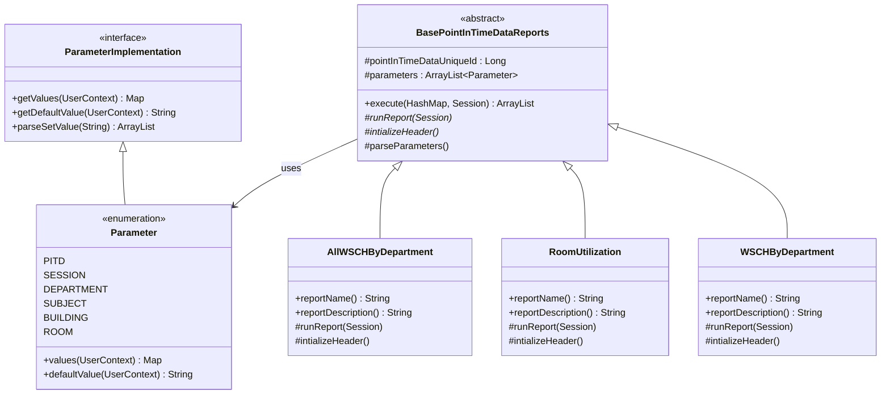

# UML Diagram (Based on Reverse Engineering)
The following class diagram represents the **Point-In-Time Data Reporting Subsystem** (`org.unitime.timetable.reports.pointintimedata`), which is responsible for generating various scheduling and utilization reports.

